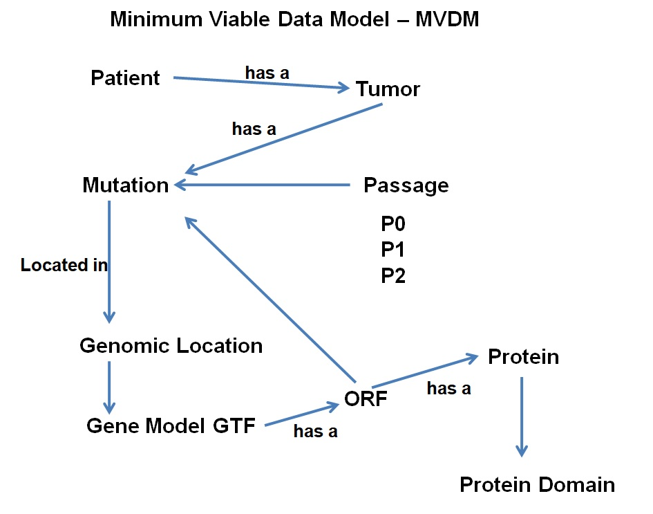
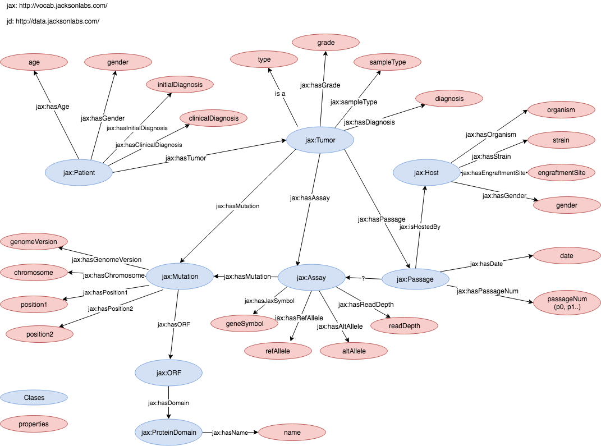

# JaxTeam

Our team is looking at the way forward in terms of the problem of too many ontologies. This tool is also a way to harmonize the diverse databases that we have from a number of research groups.

# Pipeline
This pipeline entails the following steps:  
* Data Extraction  
* Data Model  
* Data Transformation to RDF  
* FAIR Evaluation of Tool  

# Use Case

Specifically using the public JAX PDX and Mouse TUmor Biology databses, we wish to identify human cancer mutations (p53) that are lost across engrafted tumor passages in mice and to see if the remaining mutations are enriched in a particular protein domain.

Here is the minimal viable data model for this mouse:

Here is a relational model:

<a href="BioITWorld2018HackathonJAXTeamV2.pdf">Click here</a> for a PDF of the presentation explaining this project:
<a href="BioITWorld2018HackathonJAXTeamV2.pdf">BioITWorld 2018 Hackathon JAX Team Presentation</a>
